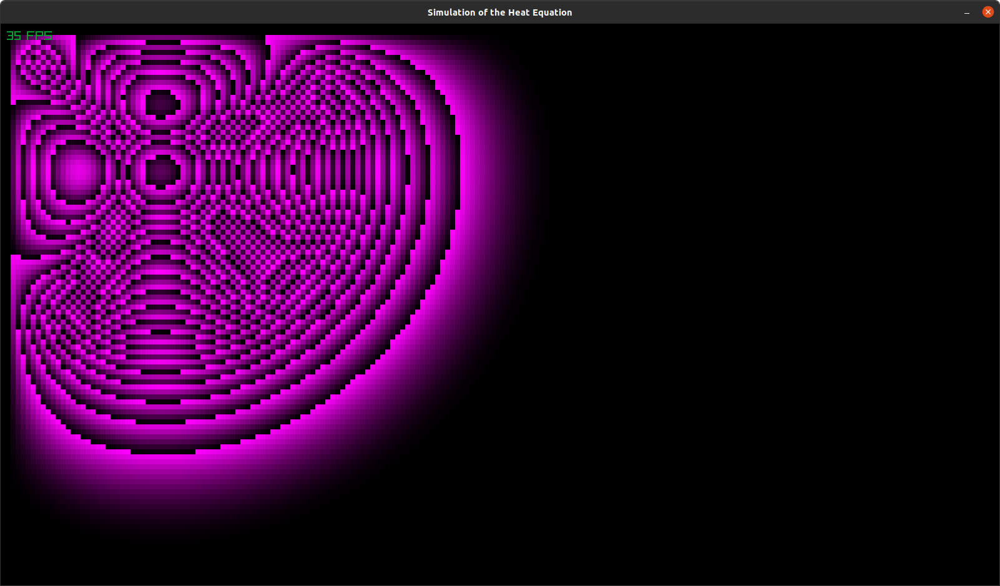

# Program that simulates the heat equation


## Exemple

[](/picture)

## Heat equation

```math
\begin{aligned}
	T_{(x, y, t)} &= \sum_{\substack{n=1 \\ m=1}}^N \frac{4}{L_x L_y} \int\limits_0^{L_x} \int\limits_0^{L_y} f(\varphi, \psi) \sin\left(n \frac{\pi}{L_x} \varphi\right) \sin\left(m \frac{\pi}{L_y} \psi\right) \, \mathrm{d}\varphi \, \mathrm{d}\psi \sin\left(n \frac{\pi}{L_x} x\right) \sin\left(m \frac{\pi}{L_y} y\right) \mathrm{e}^{-\alpha t \pi^2 \left(\frac{n^2}{L_x^2} + \frac{m^2}{L_y^2}\right)}
\end{aligned}
```
Or

```math
\begin{aligned}
	\partial T_{i,j}(t) &= \alpha \left(\frac{T_{i+1,j}(t) - 2T_{i,j}(t) + T_{i-1,j}(t)}{h^2} + \frac{T_{i,j+1}(t) - 2T_{i,j}(t) + T_{i,j-1}(t)}{h^2}\right)
\end{aligned}
```


## normalization formula

```math
\begin{aligned}
	X_{new} &= \frac{X - X_{min}}{X_{max} - X_{min}}
\end{aligned}
```


## References

- https://fr.wikipedia.org/wiki/%C3%89quation_de_la_chaleur
- http://www.lmm.jussieu.fr/~lagree/COURS/MECAVENIR/cours4_eqchal_loc.pdf
(Simulation of laplacian)
- https://visualpde.com/sim/

## TODO:
- Add the console view
- Add the mp4 view
- Try with ODESolver
- Make the difference between cold and hot spots smoother


## Math references:
> https://fr.wikipedia.org/wiki/Laplacien_discret
> https://fr.wikipedia.org/wiki/D%C3%A9riv%C3%A9e_seconde_discr%C3%A8te
> https://fr.wikipedia.org/wiki/Diff%C3%A9rence_finie
> https://en.wikipedia.org/wiki/Taylor_series
> https://pythonnumericalmethods.studentorg.berkeley.edu/notebooks/chapter20.02-Finite-Difference-Approximating-Derivatives.html
> https://en.wikipedia.org/wiki/Finite_difference_method

_All the coefficients_
https://en.wikipedia.org/wiki/Finite_difference_coefficient

Stencil:
> https://en.wikipedia.org/wiki/Stencil_(numerical_analysis)
> https://en.wikipedia.org/wiki/Five-point_stencil#cite_note-1
> https://en.wikipedia.org/wiki/Nine-point_stencil

Here is the exemple for stencil
Implicit method
1   1   1
0   1   0
0   0   0

Explicit method
0   0   0
0   1   0
1   1   1

Crank–Nicolson method
1   1   1
0   1   0
1   1   1


Here is a test with matrix
Five-point stencil
    1    
1  -4   1
    1    


       i+1,0     
j-1,0    i,j  j+1,0
       i-1,0     
